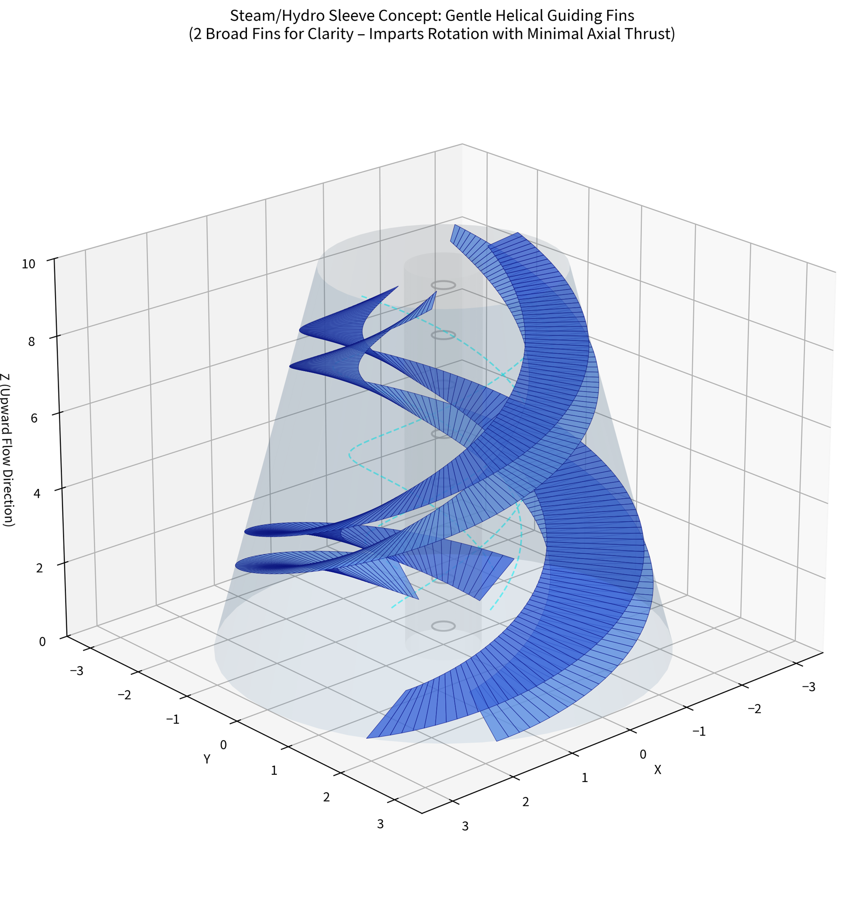

**Hydro Sleeves – Detailed Design & Operation**
---

The hydro sleeves are the core energy extraction components of the VORTEX system. They convert the kinetic energy of flowing water into rotational mechanical energy, which is then transferred to a driveshaft and generator. This is **one practical implementation** of an open-flow turbine concept — many variations are possible.

### Overview & Purpose
Hydro sleeves are modular, extractable turbine units installed directly in the main canals. They are designed for distributed, low-head energy harvesting while remaining easy to maintain and replace. The baseline favors parallel paired sleeves per section for stability and mechanical simplicity, though grouped arrangements (tri/quad) are possible with adjusted canal geometry.

### Design Details
- **Basic form**: Cylindrical sleeve with internal gradient spiral/helical fins attached to the inner wall (visualization inspiration: wall-mounted helical guiding fins in a tapering cylinder — see mathematical visualization below).
- **Typical dimensions** (reference scale): Approximately 1.5–3 m in diameter and 6–8 m long, depending on canal size and desired torque.
- **Tapering**: Inlet wider (100%), narrowing toward the exit (~75%) for velocity increase and balanced torque.
- **Magnetic coupling system**:
  - SmCo rings for radial/axial centering and low-friction rim drive.
  - Forward ring/magnet setup to cancel axial thrust from water flow.
  - Rear overlapping ring with the incoming pipe for alignment.
- **Extractability**: Divert flow to overflow, disengage front magnet, pull sleeve forward along guide rails via ceiling crane, load onto wall rails for inspection. Replacement reverses the process.

### Flow Interaction & Anticipated Effects
- **Pre-rotation**: Transition zone includes grooves/fins to impart initial spin.
- **Torque generation**: Primarily in the first half of the sleeve; second half provides stabilization.
- **Slope integration**: The sleeve runs horizontal (0°) while the main canal continues the 30° tunnel slope. The high-velocity exit jet becomes airborne before cushioning in the widened post-sleeve canal/overflow.
- **Self-cleaning tendency**: Continuous flow and rotation help limit fouling compared to static surfaces.
- **Gap & Leakage Management**: A small gap between the pipe transition and sleeve is expected. Collection channels/gutters in the dry gallery catch and reroute any ingress back into the lower canal or basin.

### Generator Connection Arrangements
- **Paired configuration** (baseline): Two sleeves per shared drive shaft (one clockwise, one counterclockwise) with the center shaft between them for torque balance.
- **Indirect coupling** (preferred): External cogs connect via idler gears or gearboxes to the main driveshaft in a dry gallery.
- **Generator placement**: In protected dry rooms; gearboxes match RPM as needed.

### Options & Variants
- Fin geometry, pitch, and taper ratio can be optimized via CFD and testing.
- Grouping (pairs, tri/quad) and coupling methods (magnetic, geared, hybrid) are flexible.
- Materials: Lightweight, high-strength composites or coated metals chosen for corrosion resistance, temperature tolerance, and low weight. Recyclable at end of life.
- **Reversibility (Pump / Circulator Mode)**: The sleeve concept can be reversed to act as an inline pump or circulator for low-flow mixing or circulation.

### Projected Performance & Considerations
Power output depends on flow rate, head (slope), heat input, and overall system optimization (see Power Integration examples for scaling). Rough illustrative ranges are provided in the main documentation; real results require CFD, physical prototyping, and site-specific engineering. All performance numbers should be treated as directional guidance with clear assumptions.

### Maintenance & Modularity
- Sleeves are designed for quick extraction using rail-guided systems and magnetic decoupling.
- External cogs and gearboxes are accessible from the dry maintenance gallery.
- Modular design allows individual sleeve replacement without affecting neighboring units.

### Integration with Canal & Basin System
- Sits after the pre-rotation transition zone.
- Benefits from overflow cushioning and basin level control.
- No direct thermal dumping in sleeve zones (space for driveshafts + controlled evaporation).

**Mathematical Visualization** (helical guiding fins in a tapering sleeve — for illustration; actual fin count/pitch to be optimized):

**Generated concept art of Hydro sleeve turbines**

---

**Previous**: [Hydro-sleeves](../hydro-sleeves.md)
**Index**[-Index-](../../../Index.md)
**Next**: [Steam-sleeves](../steam-sleeves.md)
